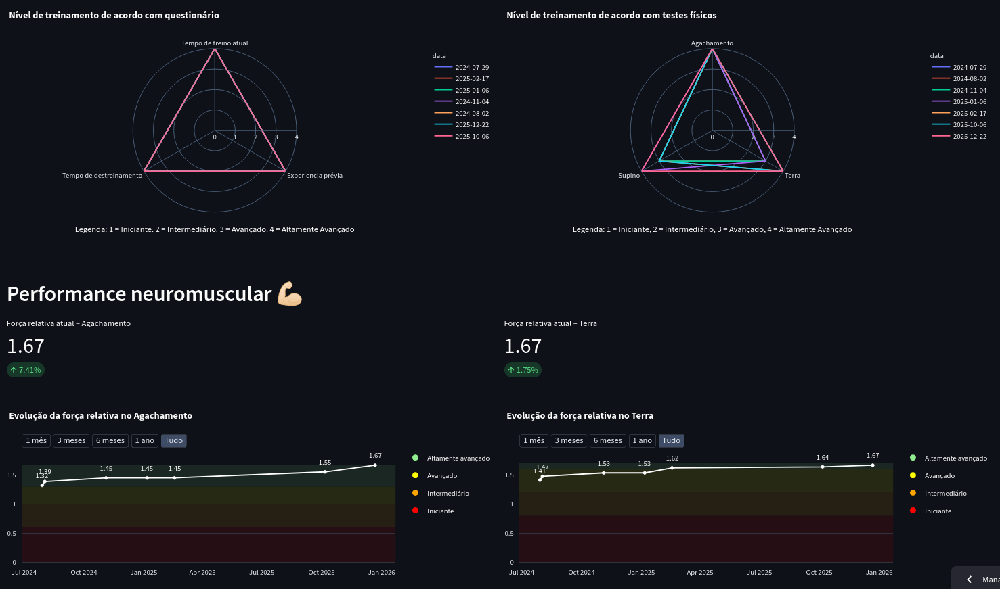
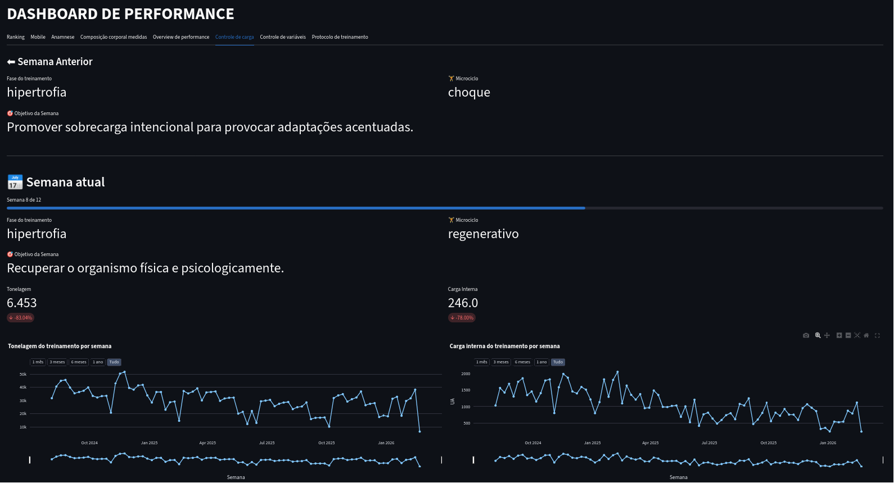
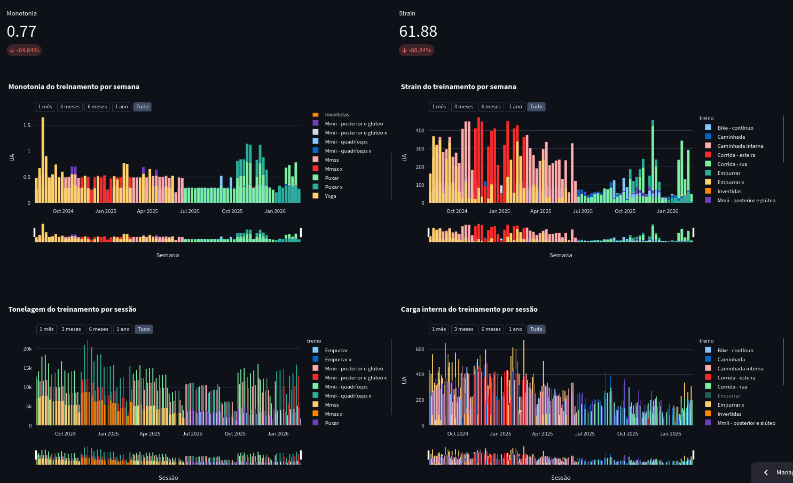

# Training Load Analytics & Prescription Platform

> **Note:** This is a proprietary project and the core technology of a startup venture. The source code is private, but this documentation serves as a technical case study of my development capabilities.

## 📋 Project Overview
A full-stack data solution designed to monitor, analyze, and visualize strength training loads. It translates complex physiological variables into actionable insights for coaches and athletes.

## 🛠️ Tech Stack & Architecture
* **Language:** Python (Data Processing) & JavaScript (Google Apps Script)
* **Environment:** Google Colab (Workflow & Modeling)
* **Data Source:** Google Sheets (Automated via JS scripts)
* **Frontend/UI:** Streamlit (Daily performance dashboard)
* **Integration:** Git & GitHub for version control and deployment

## ⚙️ Key Technical Challenges Solved
* **Automated Data Ingestion:** Developed a pipeline to fetch raw training data from cloud-based spreadsheets, ensuring real-time updates without manual file uploads.
* **Mathematical Modeling:** Implemented algorithms to calculate relative intensity, weekly volume stress, and recovery indicators based on physiological principles.
* **UX/UI Design:** Created a clean, interactive dashboard that allows users to filter data by date, athlete, and exercise type.

## 🚀 Impact
This system is currently the foundation of a startup, helping users optimize performance through data-driven decision-making.

---

## 📊 System Modules & Interface
The platform features 8 interactive dashboards. Below are the core modules demonstrating the transition from prescription to holistic analysis:

| 📋 Prescription & Modeling | 📈 Performance Overview |
|:---:|:---:|
|  |  |
| *The system transforms prescriptions into graphs for easier interpretation.* | *A holistic view of the athlete's status, summarizing key performance indicators (KPIs).* |

| ⚖️ Load Control (Internal/External) | 🔄 Multi-activity Management |
|:---:|:---:|
|  |  |
| *Detailed tracking of training tonnage and internal load markers to monitor physiological stress.* | *Integration of all physical activities into a single ecosystem for total load management.* | 

---

*For inquiries regarding the architecture or specific logic used in this project, feel free to contact me via LinkedIn.*
